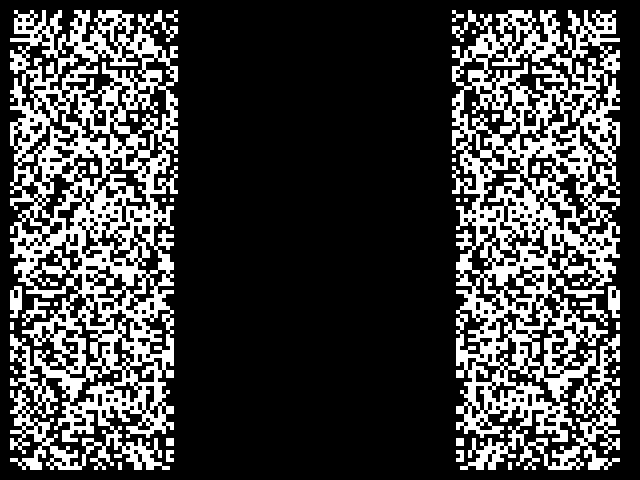
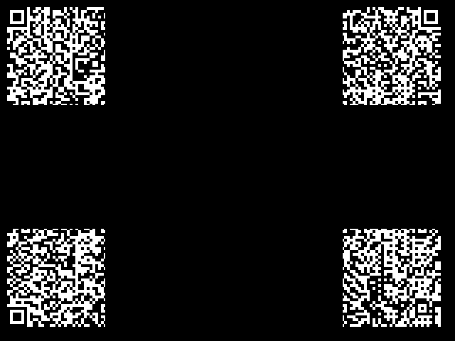

# BALLS Live Video
This program was developed for the SEDS-UCF 39-B 2 stage rocket. It interfaces with 2 Blue Raven flight controllers, a Runcam Split 4 v2, and a video transmitter to attempt to establish live video and telemetry at high altitudes.

----

## Operation
The program was designed to require minimal setup, with the majority of required configuration being on the identification of required USB serial ports.

---

## Installation


### Linux-Specific

#### Postgres Installation
Install and configure postgresql with `sudo apt install postgresql`. In order to use postgresql out of the box, you'll need to configure a few things first.

Navigate to `/etc/postgresql/[VERSION NUMBER]/main/pg_ident.conf`. You should see an area at the bottom of the file denoting `MAPNAME`, `SYSTEM-USERNAME`, and `PG-USERNAME`. Add the following:
```
# MAPNAME       SYSTEM-USERNAME     PG-USERNAME
  user1         [YOUR USERNAME]     postgres
```
If you don't know your username, run `whoami` in the terminal and use the resulting name.

Now, navigate to `/etc/postgresql/[VERSION NUMBER]/main/pg_hba.conf`. There should already be a line in here that says `local all postgres peer`. If there is not, add it. Additionally, add `map=user1` to the end of the configuration line. It should look something like this: `ocal all postgres peer map=user1`.

Now attempt to launch run the `psql`  command. If no errors occur, skip to the *Creating the Database* section. Otherwise, try the following work around:

In the terminal, run the following two commands to create a new superuser account for postgres:
```commandline
sudo -u postgres createuser -s -i -d -r -l -w [YOUR USERNAME]
sudo -u postgres psql -c "ALTER ROLE [YOUR USERNAME] WITH PASSWORD '[YOUR PASSWORD]';"
```

Now attempt to use the `psql` command again. If you still get an error, run the `createdb` command and try again.

#### Identifying Serial Ports
Identifying serial ports on Linux is a little harder than it is on Windows. Your best bet is to run `dmesg | grep tty` in the console. If your USB device is recognized, you should see a message alon the lines of `cdc_acm 1-1.3:1.0: ttyACM#: USB ACM device`. The full name of your port will be `/dev/ttyACM#`.

---

### Windows-Specific

#### Postgres Installation
For the most part, Windows installation should be considerably easier than Linux. Download a copy of [postgresql](https://www.postgresql.org/), install it, and follow the instructions. To connect, the default username and password will be `postgres` and `password` respectively. You can change these, or keep them as is.

#### Identifying Serial Ports
Serial ports are a little easier on Windows. There's a couple options with external apps like [RealTerm](https://sourceforge.net/projects/realterm/), but you can also hand-identify these ports using the Device Manager.

---

### General Instructions

#### Creating the Database

To create the database, access the `psql` command line and enter: `CREATE DATABASE <db_name>;`. If this succeeds, you should get a message stating `CREATE DATBASE`.

#### Installing Requirements

Install the requirements file with `pip install -r requirements.txt`. If `psycopg2` fails to install, try using `psycopg2-binary` instead.

#### Setting Up Credentials

Once the database has been created and the requirements installed, create a file named `.creds` in the root folder. Put the following into the file, replacing with the correct information:
```json
[
  "DATABASE_NAME",
  "DATABASE_URL",
  "DATABASE_PORT",
  "DATABASE_USERNAME",
  "DATABASE_PASSWORD"
]
```
----
## QR Encoders
This project has 4 "QR Encoders", accessible in the `overlay_utils.py` file. These encoders allow the placement of QR codes in specialized patterns onto live video feed. In this instance, they are used to ensure that telemetry data is transferred properly and with a 30% error recovery. Each of the encoder examples below are generated on a 640x480 resolution, with a QR Pixel Scale of 4.

### QR "Border"


This encoder places a QR code clockwise around the frame, creating a "border" from the data. In terms of radio transmission, this method is theoretically resilient to data corruption on the start and end of frames, due to how spread out the information is.

### QR "Bars"


The bar encoder creates two mirrored "bars" on the left and right sides of a frame. Each of these bars is a copy of the QR code, meaning that two copies are transmitted at once.

### QR "Quadrants"


The quadrant encoder splits the QR code into 4 quadrants (top left, top right, bottom left, bottom right) and places them in their respective corners of the resulting frame.

### QR "Overlay"


The overlay encoder is the simplest of the 4, placing the full QR code at a specified location on the frame. 